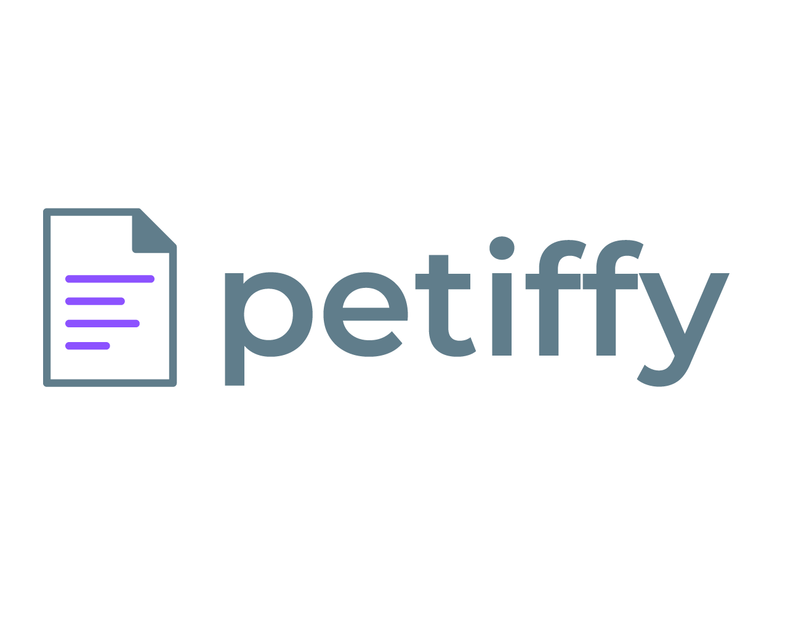
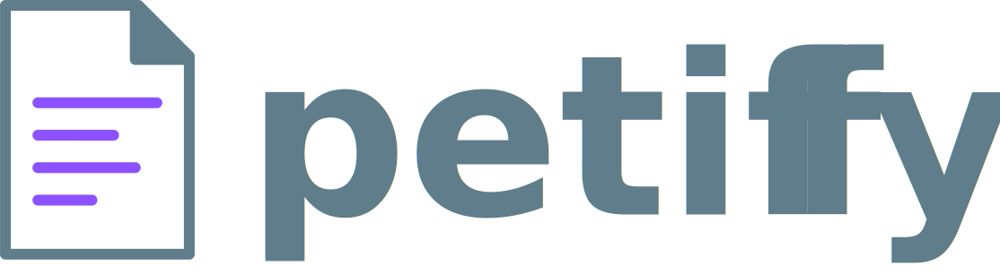

<p align="center">
   
</p>

<!-- <h1 align="center">
    
</h1>-->

<h4 align="center">
  🚀 Projeto de desenvolvimento do Frontend em React - Petiffy
</h4>

<p align="center">
  

  
  
  <a href="https://github.com/rodrigoengelberg/petiffy-frontend/commits/master">
    
  </a>

  <a href="https://github.com/rodrigoengelberg/petiffy-frontend/issues">
    
  </a>

  
</p>

<p align="center">
  <a href="#-projeto">Projeto</a>&nbsp;&nbsp;&nbsp;|&nbsp;&nbsp;&nbsp;
  <a href="#-layout">Layout</a>&nbsp;&nbsp;&nbsp;|&nbsp;&nbsp;&nbsp;
  <a href="#rocket-tecnologias">Tecnologias</a>&nbsp;&nbsp;&nbsp;|&nbsp;&nbsp;&nbsp;
  <a href="#rocket-executando">Executando</a>&nbsp;&nbsp;&nbsp;|&nbsp;&nbsp;&nbsp;
  <a href="#memo-licença">Licença</a>
</p>
<br>

## 💻 Projeto

Esse projeto está sendo desenvolvido em NodeJS utilizando modernas ferramentas de mercado com o intuito de aprendizado e experiência. O projeto consiste na parte frontend(React), mobile(React Native) e backend(NodeJs) - juntamente com typescript em todas as partes.

## 🎨 Backend

O Backend pode ser visualizado no repositório [Petiffy Backend ](https://github.com/rodrigoengelberg/petiffy-backend)

## :rocket: Tecnologias

Esse projeto foi desenvolvido com as seguintes tecnologias:

- [Typescript](https://www.typescriptlang.org/)
- [Node.js](https://nodejs.org/en/) | [Express](https://expressjs.com/pt-br/)
- [React](https://reactjs.org/) | [React Native](https://reactnative.dev/)
- [Knex](http://knexjs.org/) | [SQLite3](https://www.sqlite.org/index.html)
- [React Native Picker](https://github.com/react-native-picker/picker) 
- [React Native Collapsible ](https://github.com/oblador/react-native-collapsible)

## :rocket: Executando

Para rodar esse projeto existem duas maneiras para você escolher, a Live Version que é a versão que está rodando em nuvem para que você conferir, e a versão em Localhost, que é onde você baixa o projeto completo e roda a partir do seu terminal.

### Local Host:
Também é possível rodar essa aplicação localmente em um computador ou notebook, para isso é necessário ter alguns programas instalados:

#### Node.js e NPM

É necessário instalar o node e npm(ou yarn) para rodar essa aplicação localmente. Para verificar se já tem instalado, execulte em seu terminal os seguintes comandos:
```sh
node -v
```
```sh
npm -v
```
Caso o retorno de algum dos dois comandos sejam um erro, é necessário instalar o Node.js e o NPM.

##### Guias para download e instalação do Node.js e NPM:
Para download: acesse o [site oficial](https://nodejs.org/en/) do Node.js e siga o passo a passo.

Com o Node.js e NPM instalados corretamente, abra o seu terminal na pasta do projeto e  execute o seguinte comando:

Inicie o servidor:
```sh
npm start
```

Aguarde alguns instantes.

Caso tudo dê certo, o resultado esperado é abrir um servidor na porta 3333, você pode acessar em http://localhost:3333/.

## :memo: Licença

Esse projeto está sob a licença MIT. Veja o arquivo [LICENSE](LICENSE.md) para mais detalhes.

---

Feito com horas em frente ao :computer: por [Rodrigo Engelberg](https://www.linkedin.com/in/rodrigoengelberg/)

